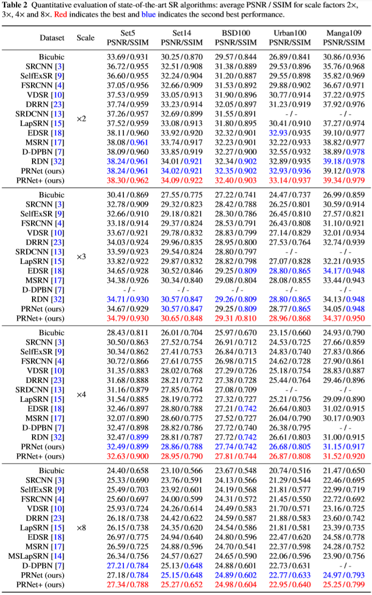
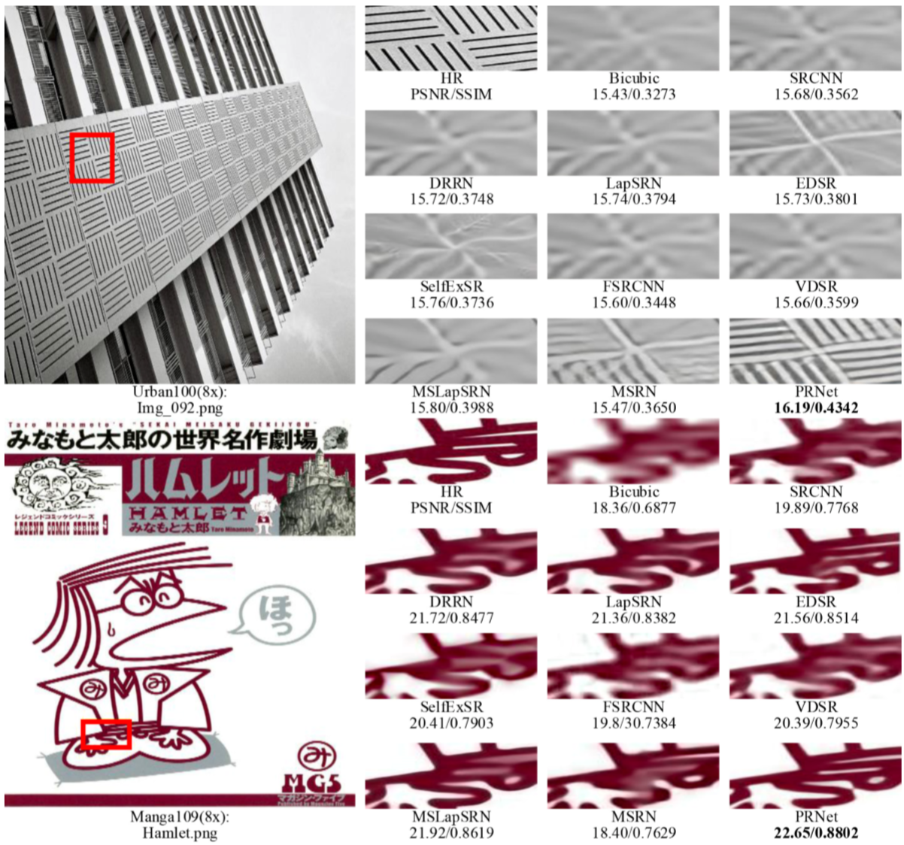

# Progressive Residual Networks for Image Super-Resolution 
[[Applied Intelligence]](http://link.springer.com/article/10.1007/s10489-019-01548-8)
-------------
This repository is for PRNet introduced in the following paper


The code is based on [EDSR (PyTorch)](https://github.com/thstkdgus35/EDSR-PyTorch) and tested on Ubuntu 18.04 environment (Python3.6, PyTorch_0.4.0, CUDA8.0, cuDNN5.1) with Titan X/1080Ti/Xp GPUs. .


The architecture of our proposed Progressive Residual Networks (PRNet). The details about our proposed PRNet can be found in [our main paper](http://link.springer.com/article/10.1007/s10489-019-01548-8).

If you find our work useful in your research or publications, please consider citing:

```latex
@article{Jin2020Progressive,
  title={Progressive residual networks for image super-resolution},
  author={Jin Wan and Hui Yin and Ai-Xin Chong and Zhi-Hao Liu},
  journal={Applied Intelligence},
  volume={50},
  number={7},
  pages={1620–1632},
  year={2020},
}
```

## Contents
1. [Train](#train)
2. [Test](#test)
3. [Results](#results)
4. [Acknowledgements](#acknowledgements)

## Train
### Begin to train

1. Cd to 'src/', run the following scripts to train models.
**You can use scripts in file 'demo' to train models for our paper.**

    ```bash
    # BI, scale 2, 3, 4, 8
    # PRNet in the paper (x2)
    python main.py --model PRNetx2 --scale 2 --save prnet_x2 --n_resblocks 32 --n_feats 256 --res_scale 0.1 --reset

    # PRNet in the paper (x3) - from PRNet (x2)
    #python main.py --model PRNetx3 --scale 3 --save prnet_x3 --n_resblocks 32 --n_feats 252 --res_scale 0.1 --reset 

    # PRNet in the paper (x4) - from PRNet (x2)
    #python main.py --model PRNetx4 --scale 4 --save prnet_x4 --n_resblocks 32 --n_feats 256 --res_scale 0.1 --reset --pre_train ../experiment/prnet_x2/model/model_best.pt

    # PRNet in the paper (x8) - from PRNet (x4)
    #python main.py --model PRNetx8 --scale 8 --save prnet_x8 --n_resblocks 32 --n_feats 256 --res_scale 0.1 --reset --pre_train ../experiment/prnet_x2/model/model_best.pt

    ```


## Test

1. Clone this repository:

   ```shell
   git clone https://github.com/jinwan1994/PRNet.git
   ```

2. All the models (BIX2/3/4/8) can be downloaded from, place the models to `./experiment/model/`. 

3. Cd to '/src', run the following scripts.

    **You can use scripts in file 'demo' to produce results for our paper.**

    ```bash
    # Standard benchmarks (Ex. PRNetx2)
    #python main.py --model PRNetx2 --data_test Set5+Set14+B100+Urban100+Manga109 --scale 2  --n_feats 256 --n_resblocks 32 --res_scale 0.1  --pre_train ../experiment/prnet_x2/model/model_best.pt --test_only # --self_ensemble --save_results --save_gt

    # Standard benchmarks (Ex. PRNet_x3)
    #python main.py --model PRNetx3 --data_test Set5+Set14+B100+Urban100+Manga109 --scale 3  --n_feats 252 --n_resblocks 32 --res_scale 0.1  --pre_train ../experiment/prnet_x3/model/model_best.pt --test_only # --self_ensemble --save_results --save_gt

    # Standard benchmarks (Ex. PRNet_x4)
    #python main.py --model PRNetx4 --data_test Set5+Set14+B100+Urban100+Manga109 --scale 4  --n_feats 256 --n_resblocks 32 --res_scale 0.1  --pre_train ../experiment/prnet_x4/model/model_best.pt --test_only # --self_ensemble --save_results --save_gt

    # Standard benchmarks (Ex. PRNet_x8)
    #python main.py --model PRNetx8 --data_test Set5_x8+Set14_x8+B100_x8+Urban100_x8+Manga109_x8 --scale 8 --res_scale 0.1 --n_feats 256 --n_resblocks 32 --pre_train ../experiment/prnet_x8/model/model_latest_282.pt --test_only # --save_results --save_gt --self_ensemble
    ```
4. Finally, SR results and PSNR/SSIM values for test data are saved to `./experiment/model/*`. (PSNR/SSIM values in our paper are obtained using matlab)

## Results

#### Quantitative Results



Benchmark SISR results. Average PSNR/SSIM for scale factor x2, x3 and x4 on datasets Set5,Set14, Manga109, BSD100 and Urban100.

#### Visual Results



Visual comparison for x8 SR on  Manga109 and Urban100. dataset.

## Acknowledgements

- This code is built on [EDSR (PyTorch)](https://github.com/thstkdgus35/EDSR-PyTorch). We thank the authors for sharing their codes.

